<h2>TensorFlow-FlexUNet-Image-Segmentation-HRSID-Satellite-Imagery-Ship  (2025/12/29)</h2>
Toshiyuki Arai 
Software Laboratory antillia.com  
This is the first experiment of Image Segmentation for <b>High resolution sar images dataset (HRSID) for Ship Detection </b> based on our <a href="./src/TensorFlowFlexUNet.py">TensorFlowFlexUNet</a> (TensorFlow Flexible UNet Image Segmentation Model for Multiclass) , 
and 
<a href="https://drive.google.com/open?id=1BZTU8Gyg20wqHXtBPFzRazn_lEdvhsbE">HRSID_JPG.rar </a> on Google drive 
in <a href="https://github.com/chaozhong2010/HRSID">HRSID</a>
  

<b>Actual Image Segmentation for MARS HRSID Images of 800x800 pixels</b> 
As shown below, the inferred masks predicted by our segmentation model trained by the dataset appear similar to the ground truth masks, but they lack precision in certain areas.
  
<table>
<tr>
<th>Input: image</th>
<th>Mask (ground_truth)</th>
<th>Prediction: inferred_mask</th>
</tr>
<tr>
<td>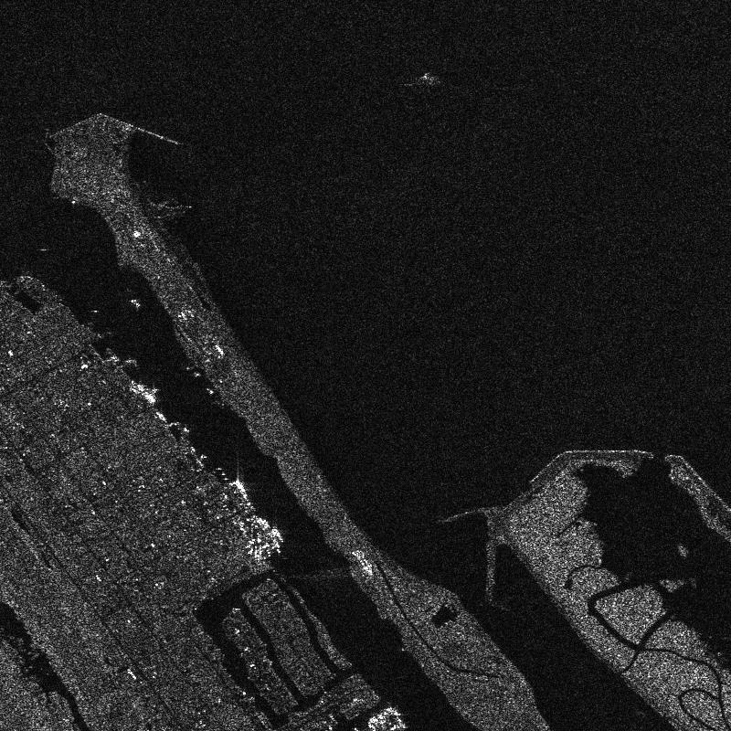</td>
<td></td>
<td></td>
</tr>

<tr>
<td>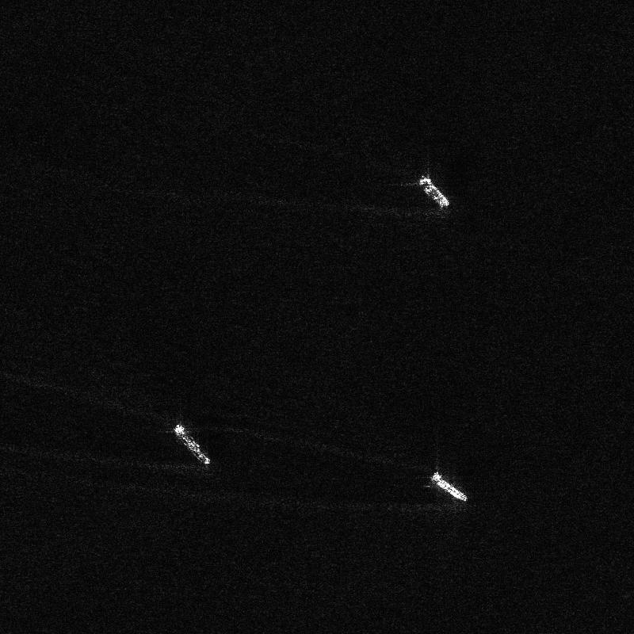</td>
<td>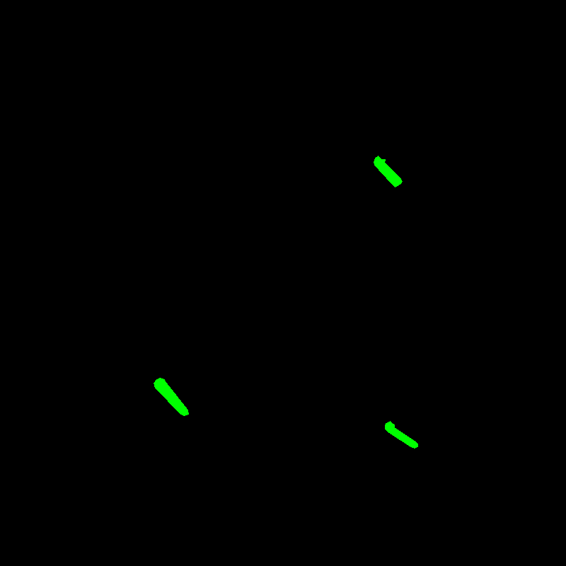</td>
<td>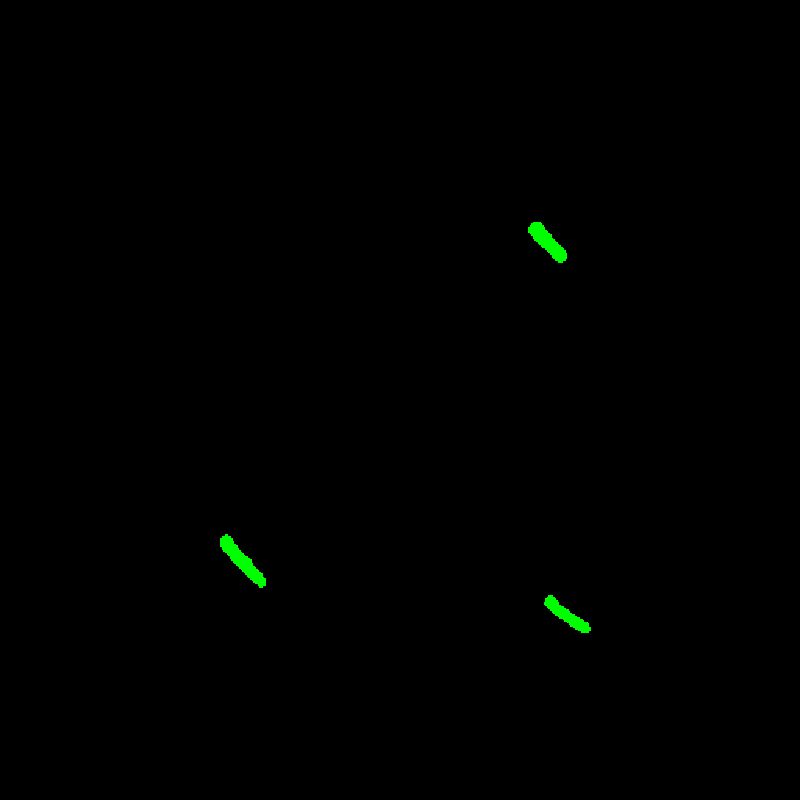</td>
</tr>
<tr>
<td>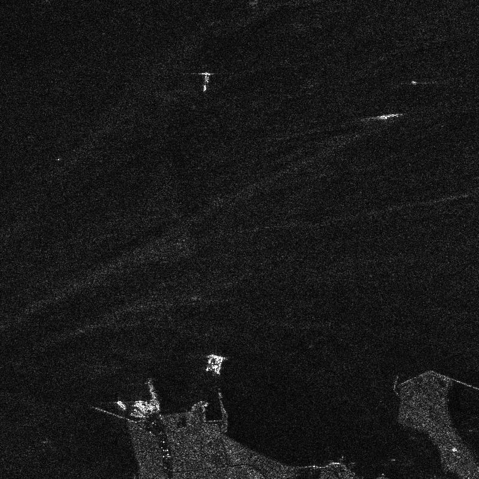</td>
<td>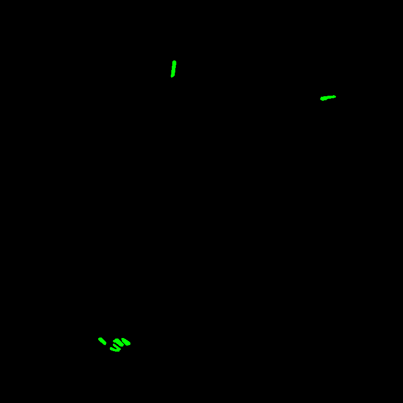</td>
<td>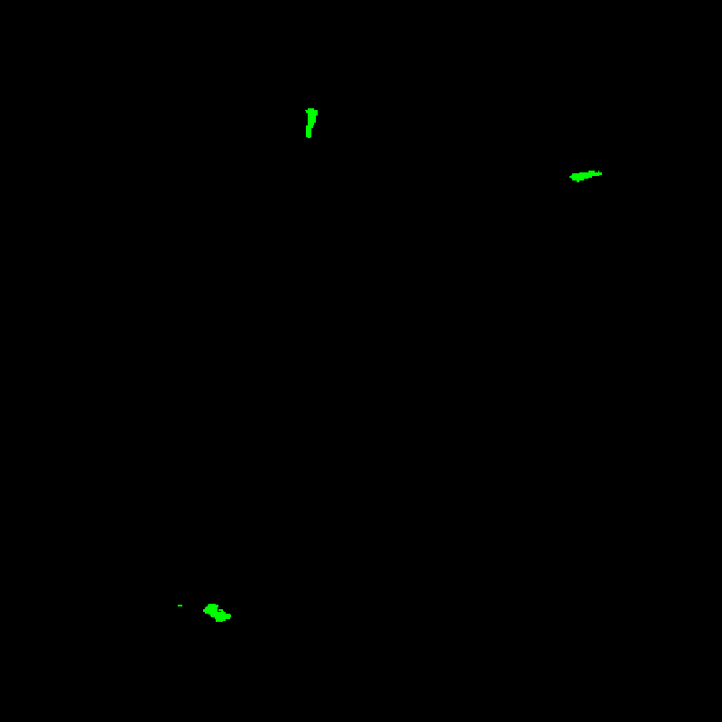</td>
</tr>
</table>

 
<h3>1  Dataset Citation</h3>
The dataset used here was derived from   
<a href="https://drive.google.com/open?id=1BZTU8Gyg20wqHXtBPFzRazn_lEdvhsbE">HRSID_JPG.rar </a> on Google drive
in <a href="https://github.com/chaozhong2010/HRSID">HRSID</a>

  
<b>HRSID</b> 
High resolution sar images dataset (HRSID) is a data set for ship detection, semantic segmentation, and instance 
segmentation tasks in high-resolution SAR images.  
This dataset contains a total of 5604 high-resolution SAR images and 16951 ship instances. HRSID dataset draws on the construction process of 
the Microsoft Common Objects in Context (COCO) datasets, including SAR images with different resolutions, polarizations, 
sea conditions, sea areas, and coastal ports.  
This dataset is a benchmark for researchers to evaluate their approaches. For HRSID, the resolution of SAR images is as follows: 0.5m, 1 m, and 3 m.
 
 
<b>Citation</b> 
[1] Shunjun Wei ; Xiangfeng Zeng ; Qizhe Qu ; Mou Wang ; Hao Su ; Jun Shi.  
<a href="https://ieeexplore.ieee.org/document/9127939?denied=">
<b>HRSID: A High-Resolution SAR Images Dataset for Ship Detection and Instance Segmentation . IEEE Access</b>
</a>
 
 
<b>License</b> 
<a href="https://github.com/chaozhong2010/HRSID?tab=GPL-3.0-1-ov-file#readme"> GPL-3.0 license</a>
 
 
<h3>
2 HRSID ImageMask Dataset
</h3>
 If you would like to train this HRSID Ship Segmentation model by yourself,
please down load the <a href="https://drive.google.com/open?id=1BZTU8Gyg20wqHXtBPFzRazn_lEdvhsbE">HRSID_JPG.rar </a> on Google drive
, and expand the downloaded in a working directory. 
The folder structure of the <b>HRSID_JPG</b> dataset is the following.  
<pre>
./HRSID_JPG
├─annotations
│   ├─test2017.json
│   ├─train_test2017.json
│   └─train2017.json
└─JPEGImages
      ├─P0001_0_800_7200_8000.jpg
      ...
      └─P0137_109
</pre>
We used a Python script <a href="./generator/ImageMaskDatasetGenerator.py">ImageMaskDatasetGenerator.py</a> to generate 
our train HRSID-Image-Mask subset from the JSON file <b>annotations/train2017.json</b> and the JPG files in <b>JPEGImages</b>. and split the
Image-Mask dataset into <b>test</b> , <b>train</b> and <b>valid </b> subsets. 
<pre>
./dataset
└─HRSID
    ├─test
    │   ├─images
    │   └─masks
    ├─train
    │   ├─images
    │   └─masks
    └─valid
        ├─images
        └─masks
</pre>
 
<b>HRSID Statistics</b> 
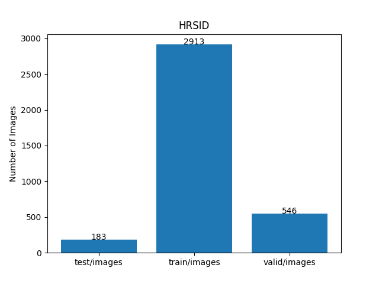 
 
As shown above, the number of images of train and valid datasets is large enough to use for a training set of our segmentation model.
  
<b>Train_images_sample</b> 
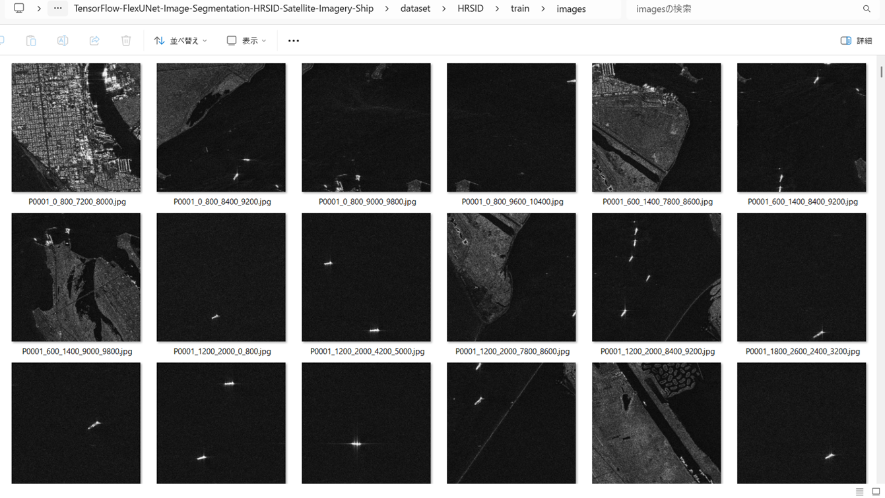
 
<b>Train_masks_sample</b> 
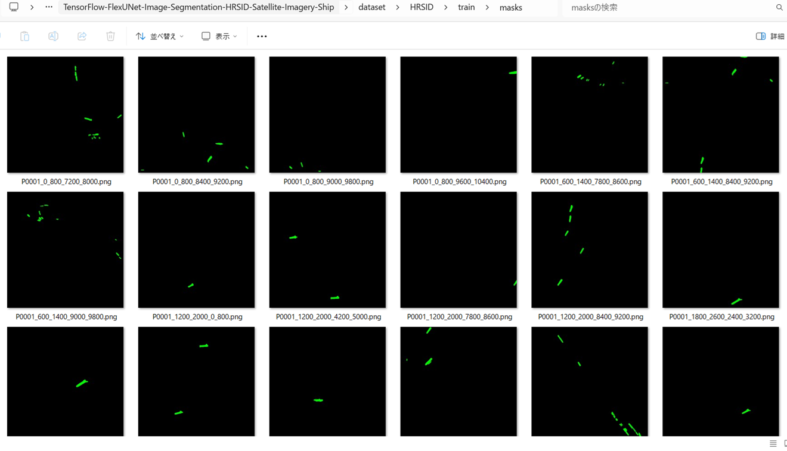
 

<h3>
3 Train TensorflowFlexUNet Model
</h3>
 We trained HRSID TensorflowFlexUNet Model by using the following
<a href="./projects/TensorFlowFlexUNet/HRSID/train_eval_infer.config"> <b>train_eval_infer.config</b></a> file.  
Please move to ./projects/TensorFlowFlexUNet/HRSID and run the following bat file. 
<pre>
>1.train.bat
</pre>
, which simply runs the following command. 
<pre>
>python ../../../src/TensorFlowFlexUNetTrainer.py ./train_eval_infer.config
</pre>

<b>Model parameters</b> 
Defined a small <b>base_filters=16</b> and a large <b>base_kernels=(9,9)</b> for the first Conv Layer of Encoder Block of 
<a href="./src/TensorflowUNet.py">TensorflowUNet.py</a> 
and a large num_layers (including a bridge between Encoder and Decoder Blocks).
<pre>
[model]
image_width    = 512
image_height   = 512
image_channels = 3
input_normalize = True
normalization  = False

num_classes    = 2

base_filters   = 16
base_kernels  = (9,9)
num_layers    = 8

dropout_rate   = 0.05
dilation       = (1,1)
</pre>

<b>Learning rate</b> 
Defined a small learning rate.  
<pre>
[model]
learning_rate  =  0.0001
</pre>

<b>Loss and metrics functions</b> 
Specified "categorical_crossentropy" and "dice_coef_multiclass". 
<pre>
[model]
loss           = "categorical_crossentropy"
metrics        = ["dice_coef_multiclass"]
</pre>
<b >Learning rate reducer callback</b> 
Enabled learing_rate_reducer callback, and a small reducer_patience.
<pre> 
[train]
learning_rate_reducer = True
reducer_factor     = 0.4
reducer_patience   = 4
</pre>
<b>Early stopping callback</b> 
Enabled early stopping callback with patience parameter.
<pre>
[train]
patience      = 10
</pre>
<b></b> 
<b>RGB color map</b> 
rgb color map dict for HRSID 1+1 classes. 
<pre>
[mask]
mask_file_format = ".png"
;HRSID 1+1
rgb_map = {(0,0,0):0,  (0, 255, 0):1,  }       
</pre>
<b>Epoch change inference callbacks</b> 
Enabled epoch_change_infer callback. 
<pre>
[train]
epoch_change_infer       = True
epoch_change_infer_dir   =  "./epoch_change_infer"
epoch_changeinfer        = False
epoch_changeinfer_dir    = "./epoch_changeinfer"
num_infer_images         = 6
</pre>
By using this epoch_change_infer callback, on every epoch_change, the inference procedure can be called
 for 6 images in <b>mini_test</b> folder. This will help you confirm how the predicted mask changes 
 at each epoch during your training process.    
<b>Epoch_change_inference output at starting (1,2,3)</b> 
 
 
<b>Epoch_change_inference output at ending (19,20,21)</b> 
 
 
<b>Epoch_change_inference output at ending (39,40,41)</b> 
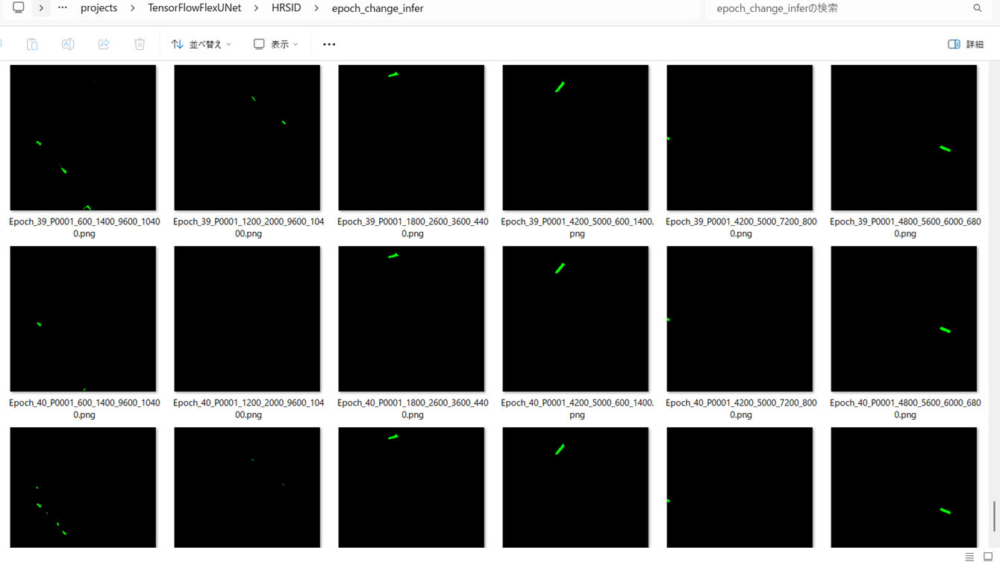 

 
In this experiment, the training process was stopped at epoch 41 by EarlyStoppingCallback.  
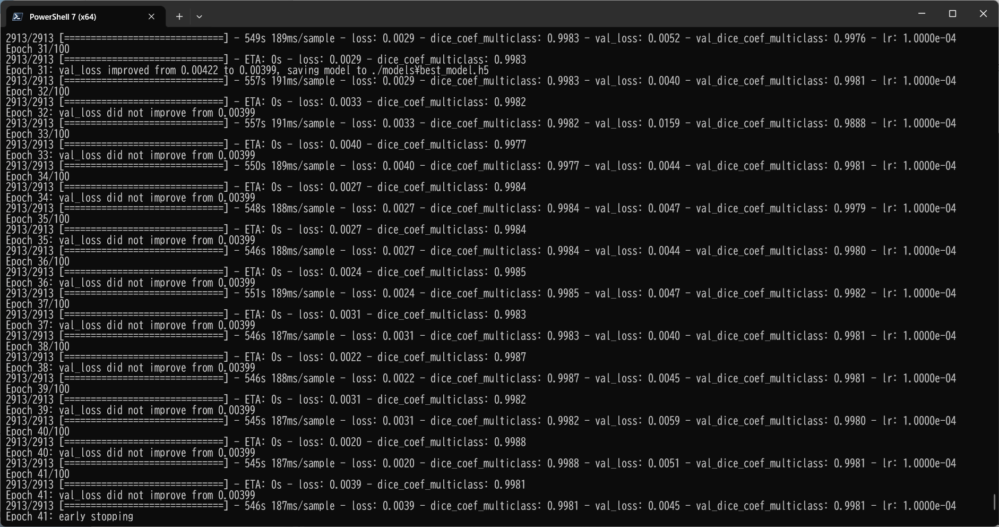 
 
<a href="./projects/TensorFlowFlexUNet/HRSID/eval/train_metrics.csv">train_metrics.csv</a> 
 

 
<a href="./projects/TensorFlowFlexUNet/HRSID/eval/train_losses.csv">train_losses.csv</a> 
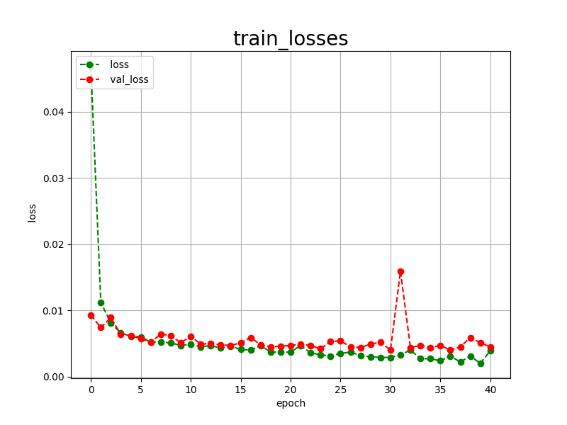 
 
<h3>
4 Evaluation
</h3>
Please move to a <b>./projects/TensorFlowFlexUNet/HRSID</b> folder, 
and run the following bat file to evaluate TensorflowFlexUNet model for HRSID. 
<pre>
>./2.evaluate.bat
</pre>
This bat file simply runs the following command.
<pre>
>python ../../../src/TensorFlowFlexUNetEvaluator.py  ./train_eval_infer.config
</pre>
Evaluation console output: 
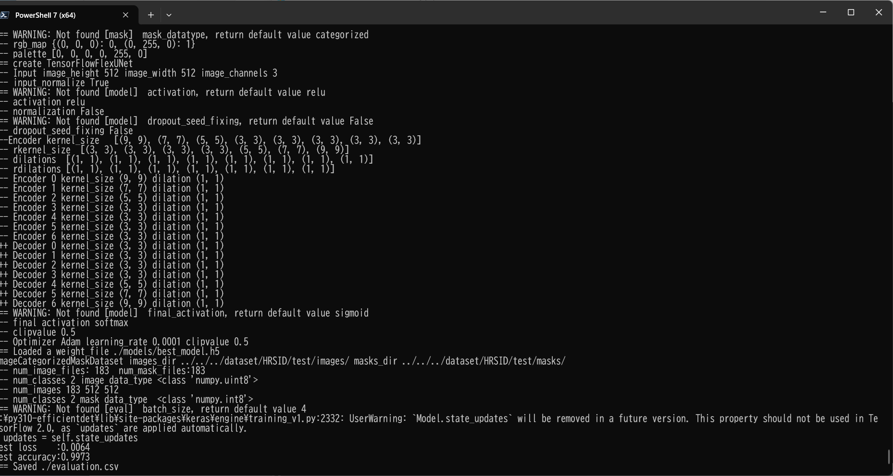
  Image-Segmentation-HRSID

<a href="./projects/TensorFlowFlexUNet/HRSID/evaluation.csv">evaluation.csv</a> 
The loss (categorical_crossentropy) to this HRSID/test was low, and dice_coef_multiclass high as shown below.
 
<pre>
categorical_crossentropy,0.0064
dice_coef_multiclass,0.9973
</pre>
 
<h3>5 Inference</h3>
Please move to a <b>./projects/TensorFlowFlexUNet/HRSID</b> folder 
,and run the following bat file to infer segmentation regions for images by the Trained-TensorflowFlexUNet model for HRSID. 
<pre>
>./3.infer.bat
</pre>
This simply runs the following command.
<pre>
>python ../../../src/TensorFlowFlexUNetInferencer.py ./train_eval_infer.config
</pre>

<b>mini_test_images</b> 
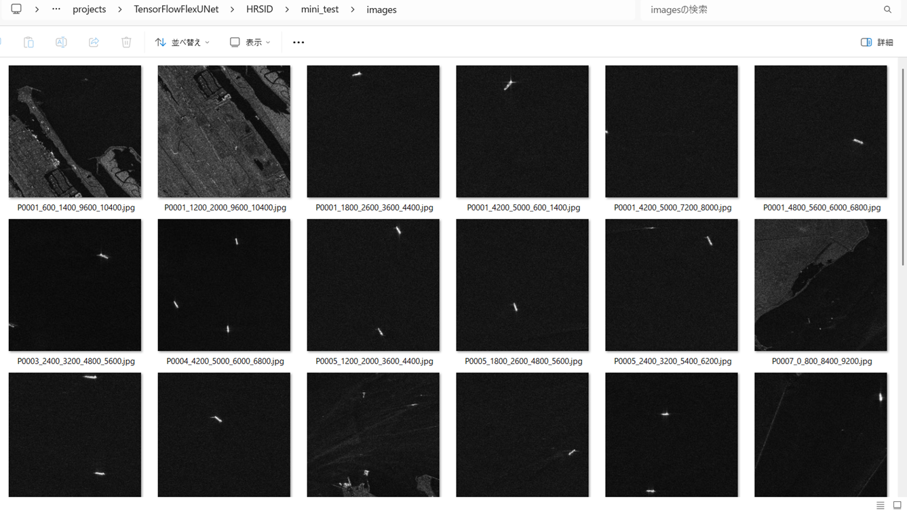 
<b>mini_test_mask(ground_truth)</b> 
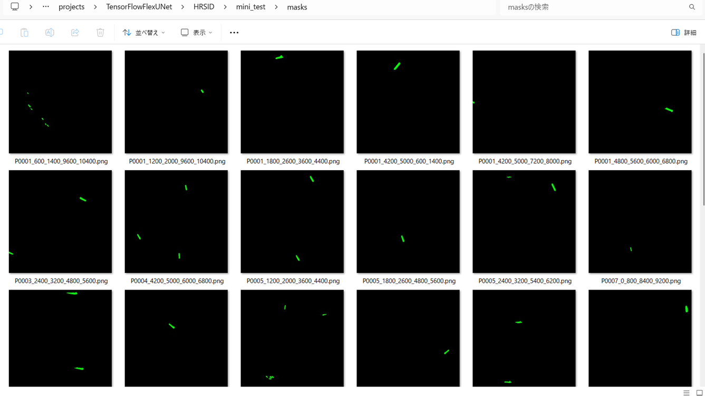 

<b>Inferred test masks</b> 
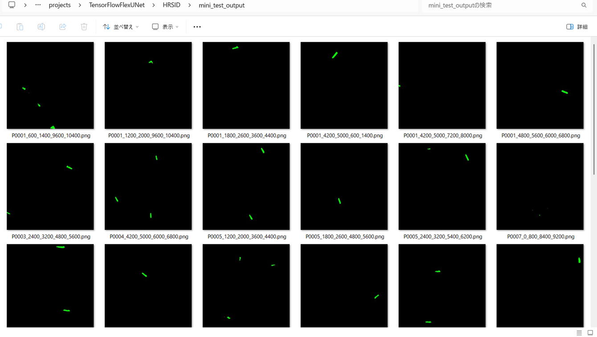 
 

<b>Enlarged images and masks for HRSID Images of 800x800 pixels</b> 
As shown below, the inferred masks predicted by our segmentation model trained by the dataset appear similar to the ground truth masks, but they lack precision in certain areas.
 
 
<table>
<tr>
<th>Input: image</th>
<th>Mask (ground_truth)</th>
<th>Prediction: inferred_mask</th>
</tr>
<tr>
<td></td>
<td></td>
<td></td>
</tr>

<tr>
<td>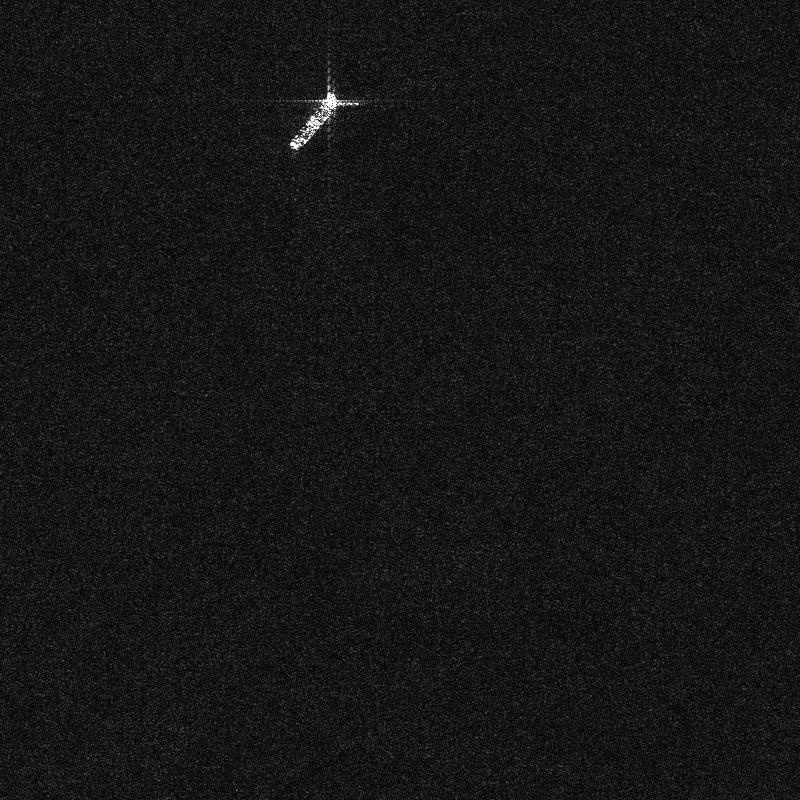</td>
<td></td>
<td></td>
</tr>

<tr>
<td></td>
<td></td>
<td></td>
</tr>
<tr>
<td></td>
<td></td>
<td></td>
</tr>
<tr>
<td>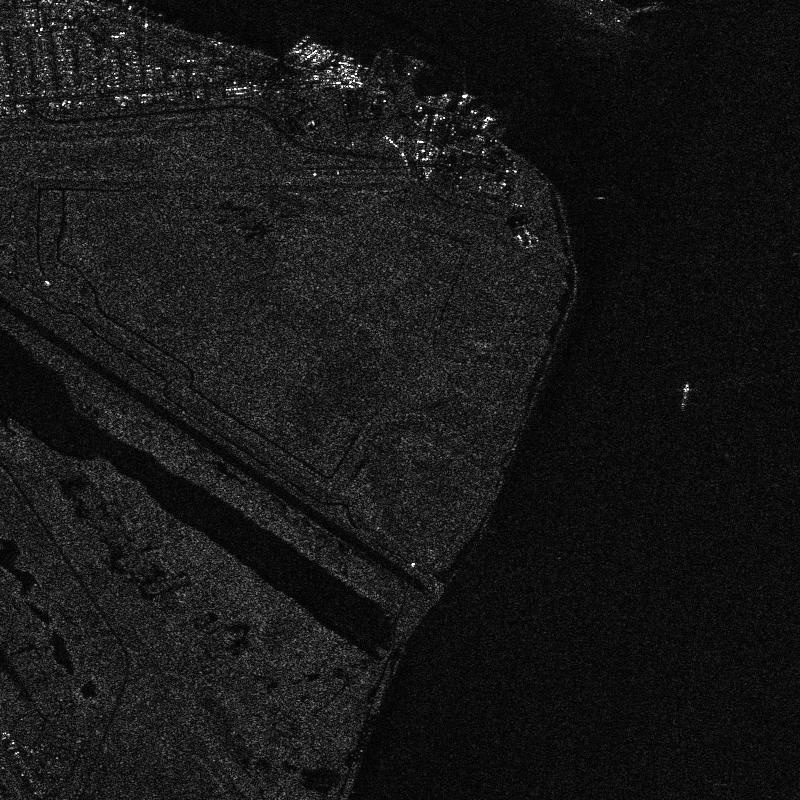</td>
<td></td>
<td></td>
</tr>
<tr>
<td>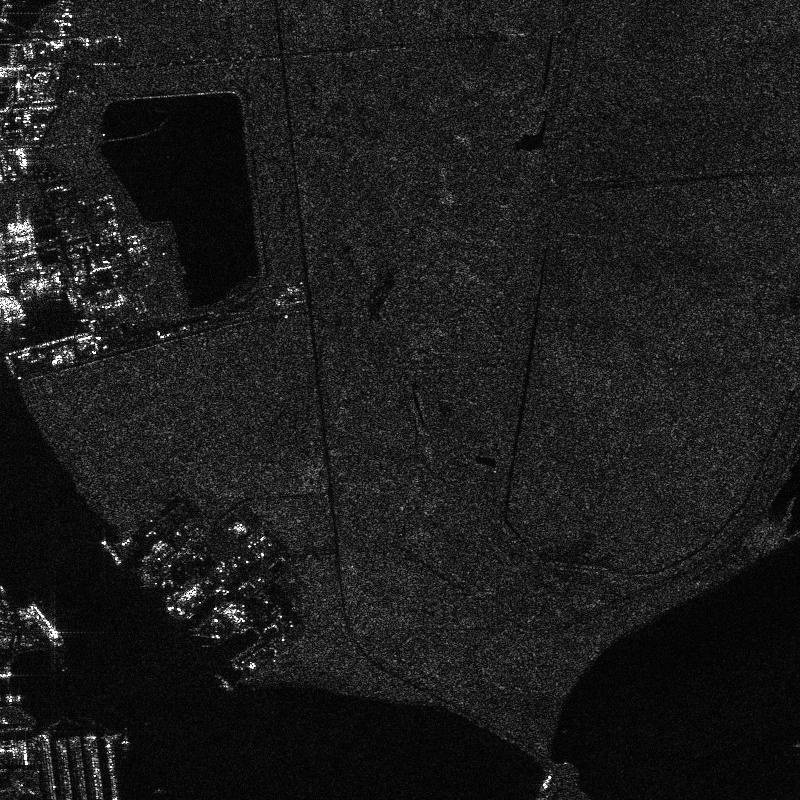</td>
<td></td>
<td></td>
</tr>
</table>

 
<h3>
References
</h3>
<b>1. HRSID: A High-Resolution SAR Images Dataset for Ship Detection and Instance Segmentation</b> 
 Shunjun Wei ; Xiangfeng Zeng ; Qizhe Qu ; Mou Wang ; Hao Su ; Jun Shi.  
<a href="https://ieeexplore.ieee.org/document/9127939?denied=">
https://ieeexplore.ieee.org/document/9127939?denied=
</a>
 
 
<b>2. Instance segmentation ship detection based on improved Yolov7 using complex background SAR images</b> 
Muhammad Yasir, Lili Zhan, Shanwei Liu, Jianhua Wan, Md Sakaouth Hossain, 
Arife Tugsan Isiacik Colak, Mengge Liu, Qamar Ul Islam, Syed Raza Mehdi, Qian Yang 
<a href="https://www.frontiersin.org/journals/marine-science/articles/10.3389/fmars.2023.1113669/full">
https://www.frontiersin.org/journals/marine-science/articles/10.3389/fmars.2023.1113669/full</a>
  

<b>3. TensorFlow-FlexUNet-Image-Segmentation-Model</b> 
Toshiyuki Arai  
<a href="https://github.com/sarah-antillia/TensorFlow-FlexUNet-Image-Segmentation-Model">
https://github.com/sarah-antillia/TensorFlow-FlexUNet-Image-Segmentation-Model
</a>
 
 
